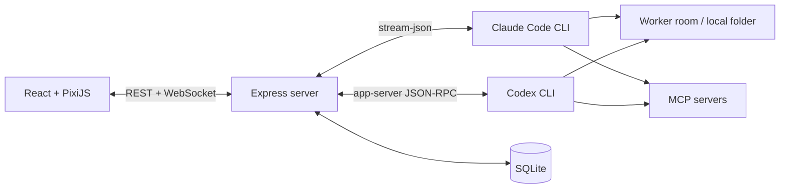

# Pixel Crew

> A local multi-agent cockpit for Claude Code and Codex — run several coding-agent sessions as pixel NPCs in one office.

[](https://github.com/juinwei7/Pixel-Crew/actions/workflows/ci.yml)
[](https://github.com/juinwei7/Pixel-Crew/releases/latest)
[](./LICENSE)
[](#requirements)
[](./WINDOWS_SETUP.md)

🌐 [Official website](https://pixelcrew.weibuilds.com/)

[English](README.en.md) · [繁體中文](README.md)

Pixel Crew puts multiple **Claude Code** and **Codex** sessions into a single pixel-art office. Each session is an NPC you can task, watch stream its output/thinking/tool calls in real time, and approve or deny permission requests.

The work itself is still carried out by the **official CLIs already installed on your machine**. Pixel Crew manages the sessions, normalizes the streaming events, and renders the interface — it never asks you to paste an API key; authentication and usage are entirely governed by your local Claude Code or Codex CLI configuration.

## Features

- **Multiple workers** — up to 20 independent Claude or Codex sessions, freely switchable at any time.
- **Focus Reader & Studios** — turn a finished NPC conversation into a distraction-free reading workspace. A collapsible Studio rail switches between managed local workspaces (with `Alt+1`–`Alt+9`), remembers the last NPC in each one, and exposes a read-only branch / commit / dirty-file / ahead-behind summary without changing the repository.
- **Persistent Boss task log** — assign work through one chat-first Boss Desk. Tasks, discovery questions, replies, cross-department progress, and final reports persist across navigation and restarts.
- **Multi-department orchestration** — the decision model builds a validated dependency graph across real departments and NPC roles, sequencing PM, engineering, QA, and others; each department receives bounded upstream reports and the Boss receives one consolidated result.
- **NPC management** — up to 20 NPCs at once, renameable from the sidebar; names and conversations are stored locally in SQLite.
- **Persistent per-NPC persona** — give an NPC a role and detailed instructions that auto-apply on every launch (injected via `--append-system-prompt` for Claude and `model_instructions_file` for Codex), surviving `/clear`, model switches, and service restarts. Personas can be saved as templates and applied to other NPCs with one click.
- **Pixel avatars** — pick from several built-in presets (classic crew, neon engineer, signal analyst, spark designer, night-shift ops), or crop, matte, and color-quantize your own PNG/JPEG/WebP into a 24×32 NPC, or upload a GIF to keep it animated. Everything is stored locally.
- **Folders as rooms** — each worker is bound to a local working folder, selectable via the native macOS/Windows folder picker, a recent-locations list, or an absolute path. Relocating an NPC in place resets its CLI session when it already has a conversation, so context never bleeds across projects.
- **Provider switching** — change an idle NPC's provider in place; an NPC with an existing conversation switches through a handoff summary instead, so incompatible native session histories are never mixed.
- **Cross-LLM handoff** — an empty NPC can switch provider in place; one with an ongoing conversation first has its goals, progress, decisions, and risks summarized, then a new session on the other provider picks up from there. The handoff summary is not a full native memory transfer, so Pixel Crew warns before switching and checks the target provider's remaining usage.
- **AI-routed department work** — as the boss, pick a decision model and describe the work in the persistent task log. If the request is too vague, touches permissions, or lacks acceptance boundaries, the model asks clarifying questions first instead of dispatching blindly. Once it has enough information, it builds an execution graph across one or more departments, passes department reports along the dependency chain, and executes — no keyword-based scoring or silent fallback. Rejected work gets up to two correction rounds; the flow only pauses for permissions, authentication, major decisions, or genuine uncertainty, and never auto-commits, pushes, merges, tags, or releases.
- **Roundtable (cheap simulated discussion)** — a single NPC internally role-plays 2–4 relevant perspectives in one pass (no tool calls, no file access) and returns a structured "viewpoints + conclusion" result. Meant for quick, low-cost sanity checks rather than a full department dispatch.
- **War Room (multi-agent debate)** — for higher-stakes questions, spin up 2–4 ephemeral peer NPCs holding distinct stances (propose / challenge / weigh, plus a fact-checking "verify" stance for hard topics), running an opening round and a rebuttal round in parallel. Model tier scales with difficulty (Haiku/Sonnet/Opus), a lead NPC synthesizes a structured verdict — consensus, disputes, prioritized actions, key metrics, and charts — and the ephemeral peers are torn down afterward. Debate history can be reviewed or deleted later.
- **Live streaming** — replies, thinking, tool input/output, and final results stream over WebSocket.
- **Image and document prompts** — paste or pick PNG/JPEG/WebP images plus text, Markdown, CSV, JSON, HTML, XML, YAML, PDF, and modern Office documents. Images use native multimodal input; documents are staged privately for the selected CLI and removed after the turn.
- **Queued follow-ups** — keep typing while an NPC is busy; follow-up messages and their attachments run in order.
- **Interactive approvals** — allow once, deny, or grant a supported scoped session rule directly in the task log; Codex additionally supports "allow for this session."
- **Work-energy HUD** — a top-of-screen HUD shows each provider's remaining usage (account-wide, not per-room or per-NPC).
- **Rich text chat** — agent replies render GitHub Flavored Markdown plus a sanitized HTML subset, including tables, code blocks, links, and images.
- **Pixel office** — NPCs walk to the task board, terminal, browser, or other stations depending on the tool they're using.
- **3D office view (optional)** — add `?theme=modern` to switch from the default pixel (2D) office to a real-time 3D "dollhouse": a glass-curtain tower with per-floor bands, a day/night lighting cycle, NPCs seated at their stations as 3D characters, and floating work windows that show — in plain language — which tool each agent is running. Drag to orbit and scroll to zoom.
- **Remote access / mobile control (optional)** — a bundled gateway puts a passcode or Google sign-in (plus brute-force lockout and time-limited share codes) in front of the local server and opens an HTTPS tunnel via cloudflared or Tailscale, so you can command your crew from a phone. The connection QR renders as a 3D neon night city that flips into a scannable aerial view — tap to explore, drag to orbit.
- **Commands / Skills** — Claude scans and caches project- and user-level native slash commands at launch; Codex preloads the app-server-native `/clear`, `/new`, `/compact`, `/review`, and separately scans repo-scoped `$skills`. Both are available immediately for a new NPC or a freshly switched room, with no throwaway message required first.
- **MCP status** — MCP servers load per active provider; you can add, remove, refresh, and inspect status (including "needs authorization") from the UI.
- **Dynamic models** — Claude exposes Opus/Sonnet/Haiku/Fable aliases; Codex reads its local CLI's model catalog directly, so the list never needs manual updates across CLI versions.
- **Session continuity** — conversations can resume via the provider's session/thread ID after a service restart.
- **Local persistence** — SQLite stores workers, recent event history, capability caches, and personas.
- **Task control** — abort a running worker without affecting other sessions.
- **Login guidance** — Claude and Codex CLI login state is checked at startup; when either is not logged in, Pixel Crew shows a safe terminal login flow and never collects credentials or tokens itself.
- **Local-first** — Pixel Crew binds to `127.0.0.1`, stores its own state in local SQLite, and adds no hosted backend or API-key form. Tasks still go through the selected provider's official CLI and service under that CLI's terms.

## Quick start

macOS users can install the self-contained app without Node.js or npm:

```bash
curl -fsSL https://github.com/juinwei7/Pixel-Crew/releases/latest/download/install-pixel-crew-macos.sh | /bin/bash
```

Windows x64 users can download the [self-contained ZIP](https://github.com/juinwei7/Pixel-Crew/releases/latest/download/pixel-crew-windows-x64.zip), extract it, and double-click `start-pixel-crew.vbs`. It keeps the local service in the background without a persistent console window; Node.js and npm are bundled.

For source development on any platform:

```bash
git clone https://github.com/juinwei7/Pixel-Crew.git
cd Pixel-Crew
cp server/.env.example server/.env   # TARGET_REPO_PATH is optional
npm install
npm run dev
```

Open <http://localhost:5173> in development. A production build runs the UI, API, and WebSocket from one service at <http://127.0.0.1:8787>. Source development needs Node.js 22.13+; the self-contained macOS and Windows releases bundle it. At least one Claude Code or Codex CLI is required. See the platform guides for [macOS](./MACOS_SETUP.md) and [Windows](./WINDOWS_SETUP.md).

### Windows quick install

[Download the self-contained Windows x64 ZIP](https://github.com/juinwei7/Pixel-Crew/releases/latest/download/pixel-crew-windows-x64.zip), extract it, and double-click `start-pixel-crew.vbs`. The service stays in the background without a persistent console window; no separate Node.js, npm, or Git install is required.

Full setup, updating, and troubleshooting steps are in the [Windows setup guide](./WINDOWS_SETUP.md).

### macOS / Linux / general development mode

Regular macOS users don't need to install Node.js or npm:

```bash
curl -fsSL https://github.com/juinwei7/Pixel-Crew/releases/latest/download/install-pixel-crew-macos.sh | /bin/bash
```

Full setup, updating, uninstalling, and certificate-free build notes are in the [macOS setup guide](./MACOS_SETUP.md). For source development on macOS/Linux:

```bash
git clone https://github.com/juinwei7/Pixel-Crew.git
cd Pixel-Crew

cp server/.env.example server/.env
```

`TARGET_REPO_PATH` is optional. If it's unset and there are no existing NPCs, the first launch asks you to pick a working folder — or you can use the auto-created `Pixel Crew Workspace`. Pixel Crew never hands an agent your entire home directory. To pin a default room, edit `server/.env`:

```dotenv
TARGET_REPO_PATH=/absolute/path/to/your/repo
```

Install dependencies and start both server and web:

```bash
npm install
npm run dev
```

Open <http://localhost:5173>. The backend runs at <http://127.0.0.1:8787> by default.

## Disclaimer

Pixel Crew is an **independent, unofficial** tool. It is not affiliated with, endorsed by, or sponsored by Anthropic or OpenAI. "Claude", "Claude Code", "Codex", and related marks belong to their respective owners. Pixel Crew merely orchestrates and visualizes the official CLIs you install and log into yourself.

## Architecture



The backend normalizes both CLIs' native events into a single Worker event protocol, forwards them to the frontend, and persists them to local SQLite. Claude runs through a persistent `stream-json` subprocess plus a local permission MCP bridge; Codex runs through a long-lived `codex app-server` JSON-RPC connection — so tool output, sub-agent activity, and approval requests all surface in real time within the same turn.

## Requirements

- Node.js 22.13 or newer for source development; the macOS/Windows end-user releases bundle it.
- macOS, Linux, or 64-bit Windows 10 22H2 / Windows 11.
- At least one of Claude Code CLI or Codex CLI installed (not being logged in yet is fine — the UI walks you through login).
- A local repository that you're comfortable letting the chosen agent operate on.

Confirm the CLIs are available:

```bash
node --version
claude --version
codex --version
```

If you haven't logged in yet, you can start Pixel Crew first and then follow the on-screen prompt to run, in a terminal:

```bash
claude auth login
# or
codex login
```

## Usage

1. Pick `Claude Code` or `Codex` from the provider menu in the top right. An idle NPC switches type in place; one with an existing conversation shows the handoff risk and target usage first, then hands off via a summary once confirmed.
2. Click the room name at the top of the screen. macOS and Windows can use the native folder picker directly, or you can type an absolute local path or pick a recent room. The current NPC relocates in place — this never creates additional NPCs.
3. Type a task for the active worker in the bottom composer (`Enter` to send, `Shift+Enter` for a new line; images can be pasted directly). IME composition is respected, so committing a character with `Enter` won't accidentally send the message. You can keep typing while a worker is busy — follow-ups queue and send in order.
4. Claude workers can type `/` to see room-, user-, and CLI-level native slash commands; Codex workers can type `/` for Pixel Crew's supported native conversation controls, or `$` for the current room's repo skills. Provider-specific TUI-only controls (model, permissions, MCP, etc.) are exposed through Pixel Crew's own top-bar UI instead.
5. Set a **persona / role** from an NPC's "•••" menu: fill in a role and detailed instructions and the NPC will work from that persona going forward. Personas can be applied from, or saved as, reusable templates.
6. Use **Boss Desk** to assign work: pick a decision model, then describe the goal (acceptance criteria are optional; you don't need to preselect an NPC or department). The decision model reasons over each eligible department's purpose, member roles, and instructions; if it's not confident enough, it asks you for more detail first. Once routing succeeds, the department lead picks either a focused Consult/Review or a full Mission based on member roles, plans automatically, starts immediately, hands off in sequence with bounded corrections, and submits one department report at the end. A single-member department can execute work, but an independent Review needs at least two members.
7. Use the `+` button in the bottom left to create a new worker on the same provider and room, then switch between tasks via tabs.
8. Open the avatar workshop from an NPC's menu — choose an official preset, or upload an image and preview cropping, positioning, background removal, and color-count reduction before applying it.
9. Click the MCP status indicator at the top to see the servers currently configured for the active provider; Claude and Codex configurations are independent of each other.
10. The WORK ENERGY panel at the top shows Claude's and Codex's remaining usage. You can switch to another worker while one is running, or press "Abort" to stop the current turn.
11. Use **Focus Reader** in the task log for a dedicated report view. Its header states the current NPC's provider and concrete model; the left **Studios** rail can collapse or expand, and selecting a studio restores its last-read NPC. Git details on studio cards are inspection only: Pixel Crew does not fetch, checkout, commit, or push from this view.

The top right separately shows server status and the active provider's status. When a CLI isn't logged in, Pixel Crew pauses sending for that provider, shows the login command, and rechecks every 3 seconds; if the other provider is already logged in, you can switch to it directly from the guidance screen.

Project-specific workflows can live in the target repo's `.claude/commands/`, `CLAUDE.md` (Claude), or `AGENTS.md` (Codex). Pixel Crew doesn't hardcode any workflow, so each repository can keep its own commands and conventions.

## Configuration

### Server

Config file: `server/.env`

| Variable | Default | Description |
| --- | --- | --- |
| `TARGET_REPO_PATH` | `~/Pixel Crew Workspace` | Optional absolute path for the default room; if unset and there's no existing NPC, you'll be asked to confirm a workspace on first launch |
| `PERMISSION_MODE` | `acceptEdits` | Permission mode passed to the Claude CLI |
| `CLAUDE_BIN` | `claude` | Claude CLI command or absolute path |
| `CODEX_BIN` | `codex` | Codex CLI command or absolute path |
| `CODEX_SANDBOX` | `workspace-write` | Sandbox mode passed to the Codex CLI |
| `HOST` | `127.0.0.1` | Backend listen address |
| `PORT` | `8787` | Backend port |
| `DB_PATH` | OS per-user app-data directory | SQLite database location; defaults to `%LOCALAPPDATA%\Pixel Crew\cockpit.sqlite` on Windows |
| `AVATAR_DIR` | `avatars/` next to the database | Local storage directory for normalized NPC PNGs and validated GIFs |

### Web (advanced)

Config file: `web/.env`

| Variable | Default | Description |
| --- | --- | --- |
| `VITE_SERVER_URL` | Same-origin / Vite proxy | Only needed if you deliberately run the server on a different loopback port |
| `VITE_WS_URL` | Same-origin / Vite proxy | Only needed if you deliberately run the server on a different loopback port |

## Local data & security

- The backend listens only on `127.0.0.1` by default; it's positioned as a personal, local-only tool.
- SQLite stores user messages, thinking, tool input/output, and each NPC's persona, defaulting to the OS's per-user app-data directory (`%LOCALAPPDATA%\Pixel Crew` on Windows).
- Uploaded avatar source images are processed entirely in the browser; the server only ever stores validated 24×32 PNGs. GIFs are kept as-is to preserve animation, capped at 2 MiB, 320×320, 120 frames, and 8 million decoded pixels, and played back using the GIF's own per-frame timing. Both live in `avatars/` next to the database.
- A worker's room path is stored in SQLite; the actual project files stay in their original local folder and are never copied into Pixel Crew.
- Message images are only ever relayed to the active provider through the local loopback server. Codex's required local image staging files are created with `0600` permissions and deleted when the turn completes, aborts, or fails; image content is never written into Pixel Crew's SQLite event history.
- Personas are injected via a per-NPC temporary instructions file (Codex) or launch argument (Claude), created with `0600` permissions and cleared when the session ends.
- Raw HTML produced by an agent is passed through an allowlist sanitizer before rendering; scripts, event handlers, and dangerous URLs are never injected directly into the page.
- `server/data/`, the real `.env` files, build artifacts, and IDE workspace files are excluded via `.gitignore`.
- On macOS/Linux, the SQLite directory is `0700` and the database plus sidecar files are `0600`; on Windows, storage lives under the current user's private `%LOCALAPPDATA%` app-data location rather than relying on POSIX chmod semantics that don't apply there.
- Adding an MCP server modifies the active provider's local user configuration; Claude and Codex configurations are independent.
- Pixel Crew never receives OAuth or bearer tokens for Codex remote MCP servers — configure those via `codex mcp login` or the terminal.
- `acceptEdits` lets Claude apply file edits automatically; choose a `PERMISSION_MODE` appropriate to the sensitivity of the target repo.

The core Pixel Crew server has no remote authentication, so `HOST` only accepts loopback addresses. For phone or external access, use the bundled **remote-access gateway** (`_tsproxy.mjs`): it fronts the core server with a passcode / Google sign-in, brute-force lockout, and time-limited share codes, and exposes an HTTPS tunnel via cloudflared quick tunnels or Tailscale; real secrets live in `_tsproxy.secret.json`, which is excluded by `.gitignore`.

## Development & verification

```bash
# Start both server and web
npm run dev

# Production build (type-check + build both packages)
npm run build

# Single production server (UI + API + WebSocket)
npm start

# Full test suite and build
npm run check

# Create a portable release staging directory
npm run package

# Server tests
npm test -w server

# Web tests
npm test -w web
```

Contributions welcome — see [CONTRIBUTING.md](./CONTRIBUTING.md).

## Current limitations

- The native folder picker supports macOS and Windows; Linux users type an absolute local path or pick a recent room.
- The initial Windows release only supports local-disk repositories — no UNC paths, network drives, or `\\wsl$`. Codex's native Windows 10 support is best-effort upstream; Windows 11 is more stable.
- No cross-device sync or multi-user account system.
- Each worker retains at most its most recent 2,000 runner events.
- Slash commands are currently Claude-only; Codex uses `$`-triggered repo skills instead. MCP management supports both Claude and Codex.
- "Allow for this session" is natively supported on Codex; whether Claude offers it depends on the installed CLI version's permission-prompt capabilities.
- This is an early-stage release; the database schema doesn't yet have a formal migration tool.
- Claude's and Codex's native session histories are not interchangeable; cross-LLM switching uses a summarized handoff, which can miss details, tool state, pending approvals, or unfinished background work.

## Tech stack

- Frontend: React, TypeScript, Vite, PixiJS
- Backend: Node.js, Express, WebSocket, TypeScript
- Persistence: Node SQLite
- Agent runtime: Claude Code CLI, Codex CLI

## License

This project is licensed under the [MIT License](./LICENSE).
