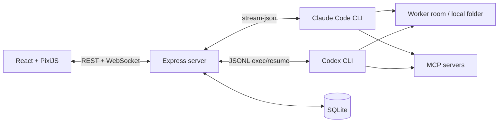

# Pixel Crew

> A local multi-agent cockpit for Claude Code and Codex.

Pixel Crew 把多個 Claude Code 與 Codex 工作階段放進一間像素辦公室。你可以同時建立多位「工人」、分派不同任務，並即時查看文字輸出、思考狀態、工具呼叫與執行結果。

實際執行工作的仍是你電腦上的官方 CLI。Pixel Crew 負責管理 session、整理串流事件並呈現操作介面，不要求在專案內另外保存 API key；認證與用量取決於本機 Claude Code 或 Codex CLI 的設定。

## 功能

- 多 Worker：建立多個獨立的 Claude 或 Codex session，任務之間可以自由切換。
- NPC 管理：最多同時建立 20 位 NPC，可從左側清單重新命名；名稱與對話會保存在本機 SQLite。
- 資料夾即房間：每位 Worker 綁定一個本機工作資料夾，並可從 Finder、最近位置或絕對路徑原地搬遷；若已有對話，搬遷會重設該 NPC 的 CLI session，避免跨專案混用上下文。
- Provider 切換：尚未對話時直接更換目前 NPC 類型；已有對話時才建立新 Worker，避免混用不相容的 session 歷史。
- 即時串流：透過 WebSocket 顯示回覆、thinking、工具呼叫及結果。
- 富文字對話：Agent 回覆支援 GitHub Flavored Markdown 與安全的 HTML 子集合，包含表格、程式碼區塊、連結與圖片。
- 像素辦公室：依照工具類型，讓角色移動到任務板、終端機、瀏覽器或其他工作站。
- Slash commands：啟動時掃描專案與使用者指令，不必先送出測試訊息。
- MCP 狀態：依目前 provider 載入 MCP servers，可在介面中新增、移除、重新整理及查看狀態。
- 動態模型：Codex 模型選單直接讀取本機 CLI model catalog，不需隨版本手動更新清單。
- Session 延續：重新啟動服務後，仍可透過 provider 的 session/thread ID 延續對話。
- 本機持久化：使用 SQLite 保存 Worker、最近的事件歷史及能力快取。
- 任務控制：可中止正在執行的 Worker，不影響其他工作階段。
- 登入引導：啟動時分別檢查 Claude 與 Codex CLI；未登入時顯示安全的終端登入流程，不會接收帳密或 token。

## 架構



後端將兩種 CLI 的原生事件正規化為相同的 Worker event protocol，再傳給前端並批次寫入本機 SQLite。Claude 使用持久的 `stream-json` 子程序；Codex 每回合使用 `codex exec --json`，後續回合以 thread ID resume。

## 系統需求

- Node.js 22.5 或更新版本（使用 Node 內建 SQLite）
- 至少安裝 Claude Code CLI 或 Codex CLI 其中一種（尚未登入也能啟動，介面會引導完成登入）
- 一個允許所選 Agent 操作的本機 repository

先確認 CLI 可用：

```bash
node --version
claude --version
codex --version
```

若尚未登入，可先啟動 Pixel Crew，再依畫面提示於終端執行：

```bash
claude auth login
# 或
codex login
```

## 快速開始

```bash
git clone https://github.com/juinwei7/Pixel-Crew.git
cd Pixel-Crew

cp server/.env.example server/.env
cp web/.env.example web/.env
```

編輯 `server/.env`，將 `TARGET_REPO_PATH` 改成預設房間的絕對路徑。啟動後仍可直接在介面選擇其他本機資料夾：

```dotenv
TARGET_REPO_PATH=/absolute/path/to/your/repo
```

安裝依賴並啟動前後端：

```bash
npm install
npm run dev
```

開啟 http://localhost:5173 。後端預設執行於 http://127.0.0.1:8787 。

## 使用方式

1. 在右上角 provider 選單選擇 `Claude Code` 或 `Codex`；空白 NPC 會原地換類型，已有對話時才建立新 Worker。
2. 點擊畫面上方的房間名稱；macOS 可直接從 Finder 選擇資料夾，也可輸入本機絕對路徑或選擇最近房間。目前 NPC 會原地搬遷，不會增加 NPC 數量。
3. 在底部輸入框對目前的 Worker 下達任務。
4. Claude Worker 可輸入 `/` 查看目前房間與使用者層級的 slash commands。
5. 使用左下角的 `＋` 建立同 provider、同房間的新 Worker，再透過分頁切換任務。
6. 點擊上方 MCP 狀態查看目前 provider 已設定的 servers；Claude 與 Codex 設定彼此獨立。
7. Worker 執行期間可以切換到其他 Worker，或按「中止」停止目前回合。

右上角會分別顯示 `SERVER ONLINE` 與目前 provider 的狀態。CLI 尚未登入時，Pixel Crew 會暫停該 provider 的訊息送出、顯示登入指令，並每 3 秒重新檢查；若另一個 provider 已登入，可直接從引導畫面切換過去。

專案特定工作流程可以放在目標 repo 的 `.claude/commands/` 與 `CLAUDE.md`。Pixel Crew 不會把任務流程寫死，因此不同 repository 可以使用自己的指令與規範。

## 設定

### Server

設定檔：`server/.env`

| 變數 | 預設值 | 說明 |
| --- | --- | --- |
| `TARGET_REPO_PATH` | 必填 | 預設房間的絕對路徑；各 Worker 可在介面另選工作位置 |
| `PERMISSION_MODE` | `acceptEdits` | 傳給 Claude CLI 的權限模式 |
| `CLAUDE_BIN` | `claude` | Claude CLI 指令或絕對路徑 |
| `CODEX_BIN` | `codex` | Codex CLI 指令或絕對路徑 |
| `CODEX_SANDBOX` | `workspace-write` | 傳給 Codex CLI 的 sandbox 模式 |
| `HOST` | `127.0.0.1` | 後端監聽位址 |
| `PORT` | `8787` | 後端連接埠 |
| `DB_PATH` | `server/data/cockpit.sqlite` | SQLite 資料庫位置 |

### Web

設定檔：`web/.env`

| 變數 | 預設值 | 說明 |
| --- | --- | --- |
| `VITE_SERVER_URL` | `http://localhost:8787` | REST API 位址 |
| `VITE_WS_URL` | `ws://localhost:8787` | WebSocket 位址 |

## 本機資料與安全性

- 後端預設只監聽 `127.0.0.1`，定位為個人本機工具。
- SQLite 會保存使用者訊息、thinking、工具輸入與工具結果，預設位置為 `server/data/cockpit.sqlite`。
- Worker 的房間路徑會存入 SQLite；實際專案檔案仍留在原本的本機資料夾，不會複製進 Pixel Crew。
- Agent 產生的原始 HTML 會經過 allowlist 清理後才顯示；腳本、事件處理器與危險 URL 不會直接注入頁面。
- `server/data/`、實際 `.env`、build 產物與 IDE workspace 已由 `.gitignore` 排除。
- SQLite 目錄權限設為 `0700`，資料庫及 sidecar 檔案設為 `0600`。
- MCP 新增功能會修改目前 provider 的本機使用者設定；Claude 與 Codex 的設定彼此獨立。
- Codex 遠端 MCP 的 OAuth 或 bearer token 不會由 Pixel Crew 接收，請透過 `codex mcp login` 或終端機設定。
- `acceptEdits` 會允許 Claude 自動進行檔案編輯；請依目標 repo 的敏感度選擇適合的 `PERMISSION_MODE`。

如果將 `HOST` 改為 `0.0.0.0` 或透過反向代理公開服務，請自行加入身分驗證、TLS 與來源限制。

## 開發與驗證

```bash
# 同時啟動 server 與 web
npm run dev

# Production build
npm run build --workspaces

# Server tests
npm test -w server

# Web rich-text tests
npm test -w web
```

## 目前限制

- 原生資料夾選擇器目前支援 macOS；其他作業系統仍需輸入本機絕對路徑或選擇最近房間。
- 沒有跨裝置同步或多人帳號系統。
- 最多為每位 Worker 保存最近 2,000 筆 runner events。
- Slash commands 目前只提供給 Claude Worker；MCP 管理同時支援 Claude 與 Codex。
- 這是早期版本，資料庫 schema 尚未提供正式 migration 工具。
- Claude 與 Codex 的對話歷史不能互換；空白 NPC 可原地換類型，已有對話時會建立新 Worker，尚未自動產生交接摘要。

## 技術棧

- Frontend：React、TypeScript、Vite、PixiJS
- Backend：Node.js、Express、WebSocket、TypeScript
- Persistence：Node SQLite
- Agent runtime：Claude Code CLI、Codex CLI
