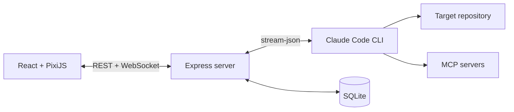

# Pixel Crew

> A local multi-agent cockpit for Claude Code.

Pixel Crew 把多個 Claude Code 工作階段放進一間像素辦公室。你可以同時建立多位「工人」、分派不同任務，並即時查看文字輸出、思考狀態、工具呼叫與執行結果。

實際執行工作的仍是你電腦上的 Claude Code CLI。Pixel Crew 負責管理 session、整理串流事件並呈現操作介面，不要求在專案內另外保存 API key；認證與用量取決於本機 Claude Code CLI 的設定。

## 功能

- 多 Worker：建立多個獨立 Claude session，任務之間可以自由切換。
- 即時串流：透過 WebSocket 顯示回覆、thinking、工具呼叫及結果。
- 像素辦公室：依照工具類型，讓角色移動到任務板、終端機、瀏覽器或其他工作站。
- Slash commands：啟動時掃描專案與使用者指令，不必先送出測試訊息。
- MCP 狀態：啟動時載入 MCP servers，可在介面中新增、移除及查看連線狀態。
- Session 延續：切換模型或重新啟動服務後，仍可透過 Claude session ID 延續對話。
- 本機持久化：使用 SQLite 保存 Worker、最近的事件歷史及能力快取。
- 任務控制：可中止正在執行的 Worker，不影響其他工作階段。

## 架構



後端會為每位 Worker 維護一個持久的 `claude` 子程序，使用 `stream-json` 收送訊息。收到的事件會正規化後傳給前端，同時批次寫入本機 SQLite。

## 系統需求

- Node.js 22.5 或更新版本（使用 Node 內建 SQLite）
- 已安裝並登入的 Claude Code CLI
- 一個允許 Claude Code 操作的本機 repository

先確認 CLI 可用：

```bash
node --version
claude --version
```

## 快速開始

```bash
git clone https://github.com/juinwei7/Pixel-Crew.git
cd Pixel-Crew

cp server/.env.example server/.env
cp web/.env.example web/.env
```

編輯 `server/.env`，將 `TARGET_REPO_PATH` 改成目標 repository 的絕對路徑：

```dotenv
TARGET_REPO_PATH=/absolute/path/to/your/repo
```

安裝依賴並啟動前後端：

```bash
npm install
npm run dev
```

開啟 http://localhost:5173 。後端預設執行於 http://127.0.0.1:8787 。

## 使用方式

1. 在底部輸入框對目前的 Worker 下達任務。
2. 輸入 `/` 查看目標 repo 與使用者層級的 slash commands。
3. 使用左下角的 `＋` 建立新 Worker，再透過分頁切換任務。
4. 點擊上方 MCP 狀態查看已設定的 servers。
5. Worker 執行期間可以切換到其他 Worker，或按「中止」停止目前回合。

專案特定工作流程可以放在目標 repo 的 `.claude/commands/` 與 `CLAUDE.md`。Pixel Crew 不會把任務流程寫死，因此不同 repository 可以使用自己的指令與規範。

## 設定

### Server

設定檔：`server/.env`

| 變數 | 預設值 | 說明 |
| --- | --- | --- |
| `TARGET_REPO_PATH` | 必填 | Claude Code 執行工作的絕對路徑 |
| `PERMISSION_MODE` | `acceptEdits` | 傳給 Claude CLI 的權限模式 |
| `CLAUDE_BIN` | `claude` | Claude CLI 指令或絕對路徑 |
| `HOST` | `127.0.0.1` | 後端監聽位址 |
| `PORT` | `8787` | 後端連接埠 |
| `DB_PATH` | `server/data/cockpit.sqlite` | SQLite 資料庫位置 |

### Web

設定檔：`web/.env`

| 變數 | 預設值 | 說明 |
| --- | --- | --- |
| `VITE_SERVER_URL` | `http://localhost:8787` | REST API 位址 |
| `VITE_WS_URL` | `ws://localhost:8787` | WebSocket 位址 |

## 本機資料與安全性

- 後端預設只監聽 `127.0.0.1`，定位為個人本機工具。
- SQLite 會保存使用者訊息、thinking、工具輸入與工具結果，預設位置為 `server/data/cockpit.sqlite`。
- `server/data/`、實際 `.env`、build 產物與 IDE workspace 已由 `.gitignore` 排除。
- SQLite 目錄權限設為 `0700`，資料庫及 sidecar 檔案設為 `0600`。
- MCP 新增功能會修改 Claude Code 的 user-scope MCP 設定。
- `acceptEdits` 會允許 Claude 自動進行檔案編輯；請依目標 repo 的敏感度選擇適合的 `PERMISSION_MODE`。

如果將 `HOST` 改為 `0.0.0.0` 或透過反向代理公開服務，請自行加入身分驗證、TLS 與來源限制。

## 開發與驗證

```bash
# 同時啟動 server 與 web
npm run dev

# Production build
npm run build --workspaces

# Server tests
npm test -w server
```

## 目前限制

- 每個 server process 只支援一個固定的 `TARGET_REPO_PATH`。
- 沒有跨裝置同步或多人帳號系統。
- 最多為每位 Worker 保存最近 2,000 筆 runner events。
- Slash commands 與 MCP metadata 仍以本機 Claude CLI 的輸出格式為準。
- 這是早期版本，資料庫 schema 尚未提供正式 migration 工具。

## 技術棧

- Frontend：React、TypeScript、Vite、PixiJS
- Backend：Node.js、Express、WebSocket、TypeScript
- Persistence：Node SQLite
- Agent runtime：Claude Code CLI
