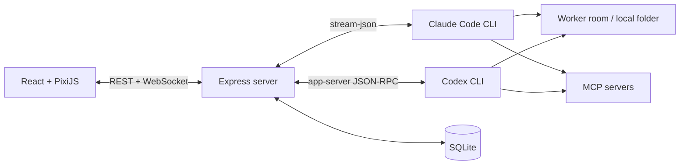

# Pixel Crew

> A local multi-agent cockpit for Claude Code and Codex — run several coding-agent sessions as pixel NPCs in one office.

[](https://github.com/juinwei7/Pixel-Crew/actions/workflows/ci.yml)
[](https://github.com/juinwei7/Pixel-Crew/releases/latest)
[](./LICENSE)
[](#系統需求)
[](./WINDOWS_SETUP.md)

🌐 [Official website](https://pixelcrew.weibuilds.com/)

**English** · [繁體中文](#zh-tw)

Pixel Crew puts multiple **Claude Code** and **Codex** sessions into a single pixel-art office. Each session is an NPC you can task, watch stream its output/thinking/tool calls in real time, and approve or deny permission requests — all running against the **official CLIs already installed on your machine**. Pixel Crew never asks you to paste an API key; authentication and usage stay in the underlying CLIs.

## Highlights

- **Multiple workers** — up to 20 independent Claude or Codex sessions, switchable at any time.
- **Persistent Boss task log** — assign work through one chat-first Boss Desk. Tasks, discovery questions, replies, department progress, and final reports persist across navigation and restart.
- **Multi-department orchestration** — the decision model can build a validated dependency graph across PM, engineering, QA, or other real departments; each department receives bounded upstream reports and the Boss receives one consolidated result.
- **Persistent per-NPC persona** — give an NPC a role + instructions that auto-apply on every launch (survives `/clear`, model switches, and restarts) and save reusable persona templates.
- **AI-routed department work** — use one “Hand to department” action; the Boss chooses a focused read-only Consult/Review or a full 2–5 step Mission, assigns same-workspace specialists, and keeps handoffs moving until completion or a real approval is needed.
- **Pixel avatars** — pick from built-in presets or upload your own PNG/GIF; everything stays local.
- **Folders as rooms** — bind each worker to a local folder; the agent runs there.
- **Live streaming** — replies, thinking, tool input/output and final results over WebSocket.
- **Image and document prompts** — paste or pick PNG/JPEG/WebP images plus text, Markdown, CSV, JSON, HTML, XML, YAML, PDF and modern Office documents. Images use native multimodal input; documents are staged privately for the selected CLI and removed after the turn.
- **Queued follow-ups** — keep typing while an NPC is busy; follow-up messages and their attachments run in order.
- **Interactive approvals** — allow once, deny, or grant a supported scoped session rule directly in the task log.
- **Work-energy HUD** — shows each provider's remaining usage at a glance.
- **Local-first** — Pixel Crew binds to `127.0.0.1`, stores its own state in local SQLite, and adds no hosted backend or API-key form. Tasks still go through the selected provider's official CLI and service under that CLI's terms.

## Quick start

macOS users can install the self-contained app without Node.js or npm:

```bash
curl -fsSL https://github.com/juinwei7/Pixel-Crew/releases/latest/download/install-pixel-crew-macos.sh | /bin/bash
```

Windows x64 users can download the [self-contained ZIP](https://github.com/juinwei7/Pixel-Crew/releases/latest/download/pixel-crew-windows-x64.zip), extract it, and double-click `start-pixel-crew.cmd`. Node.js and npm are bundled.

For source development on any platform:

```bash
git clone https://github.com/juinwei7/Pixel-Crew.git
cd Pixel-Crew
cp server/.env.example server/.env   # TARGET_REPO_PATH is optional
npm install
npm run dev
```

Open <http://localhost:5173> in development. A production build runs the UI, API and WebSocket from one service at <http://127.0.0.1:8787>. Source development needs Node.js 22.13+; self-contained macOS and Windows releases bundle it. At least one Claude Code / Codex CLI is required. See the platform guides for [macOS](./MACOS_SETUP.md) and [Windows](./WINDOWS_SETUP.md).

## Disclaimer

Pixel Crew is an **independent, unofficial** tool. It is not affiliated with, endorsed by, or sponsored by Anthropic or OpenAI. "Claude", "Claude Code", "Codex" and related marks belong to their respective owners. Pixel Crew merely orchestrates and visualizes the official CLIs you install and log into yourself.

---

<a id="zh-tw"></a>

# Pixel Crew（繁體中文）

Pixel Crew 把多個 Claude Code 與 Codex 工作階段放進一間像素辦公室。你可以同時建立多位「工人」、分派不同任務，並即時查看文字輸出、思考狀態、工具呼叫與執行結果。

實際執行工作的仍是你電腦上的官方 CLI。Pixel Crew 負責管理 session、整理串流事件並呈現操作介面，不要求在專案內另外保存 API key；認證與用量取決於本機 Claude Code 或 Codex CLI 的設定。

## 功能

- **多 Worker**：建立多個獨立的 Claude 或 Codex session，任務之間可以自由切換。
- **持久化老闆任務日誌**：從頂部 Boss Desk 以聊天方式直接交辦。任務、探索問題、回答、跨部門進度與最終報告都會保存，切換畫面或重啟後仍可繼續。
- **跨部門編排**：決策模型可依真實部門與 NPC 職務建立經過驗證的依賴圖，依序安排 PM、工程、QA 等部門；每個部門收到明確的上游報告，最後只向老闆提交一份彙整結果。
- **NPC 管理**：最多同時建立 20 位 NPC，可從左側清單重新命名；名稱與對話會保存在本機 SQLite。
- **NPC 個性 / 職務**：為每位 NPC 設定「職務」與「詳細指示」，會在每次啟動時自動注入（Claude 透過 `--append-system-prompt`、Codex 透過 `model_instructions_file`），即使 `/clear`、換模型或重啟服務都保留，不必每次重講。也能把常用人設存成範本，一鍵套用到其他 NPC。
- **像素角色**：內建多款官方角色預設（經典隊員、霓虹工程師、訊號分析師、火花設計師、夜班維運），也可從本機 PNG / JPEG / WebP 裁切、去背並降色成 24×32 NPC，或上傳 GIF 保留動態；所有檔案只保存在本機。
- **資料夾即房間**：每位 Worker 綁定一個本機工作資料夾，並可從 macOS/Windows 系統選擇器、最近位置或絕對路徑原地搬遷；若已有對話，搬遷會重設該 NPC 的 CLI session，避免跨專案混用上下文。
- **Provider 切換**：尚未對話時直接更換目前 NPC 類型；已有對話時透過摘要交接原地切換，但不混用兩邊不相容的原生 session 歷史。
- **跨 LLM 交接**：空白 NPC 可直接原地更換 provider；已有對話時，會先整理目標、進度、決策與風險，再建立另一個 provider 的新 session 接手。交接摘要不是完整原生記憶，切換前會明確提醒並檢查目標 provider 的剩餘用量。
- **AI 部門工作與辦公室**：你是老闆，只需在持久化任務日誌中選擇決策模型並直接描述工作。過於概略、涉及權限或欠缺驗收邊界時，模型會先逐題詢問，不會直接派工。資訊足夠後才建立一個或多個部門的執行圖，依相依關係傳遞部門報告並執行；不使用關鍵字配分或靜默備援。退件最多修正兩輪，只有權限、認證、重大決定或無法確認時才停下來；不會自行 commit、push、merge、tag 或 release。
- **即時串流**：透過 WebSocket 顯示回覆、thinking、工具 INPUT、執行中 OUTPUT 與最終結果。
- **圖片輸入**：可直接把 PNG / JPEG / WebP 圖片貼進底部輸入框，以 Claude / Codex 的原生多模態格式送出。
- **等待佇列**：NPC 執行期間仍可輸入文字或貼圖；後續任務會保留各自附件並依序自動送出。
- **互動式核准**：Claude Code 或 Codex 要求額外權限時，可直接在任務日誌允許一次或拒絕；Codex 另支援「本次工作階段皆允許」。
- **全域工作能量**：頂部 HUD 顯示 Claude 與 Codex 目前的剩餘用量（讀取各自 CLI 的用量資訊），為帳號共用、不隨房間或 NPC 切換。
- **富文字對話**：Agent 回覆支援 GitHub Flavored Markdown 與安全的 HTML 子集合，包含表格、程式碼區塊、連結與圖片。
- **像素辦公室**：依照工具類型，讓角色移動到任務板、終端機、瀏覽器或其他工作站。
- **Commands / Skills**：Claude 啟動時掃描專案與使用者指令並快取原生指令；Codex 會預載 Pixel Crew 可透過 app-server 原生執行的 `/clear`、`/new`、`/compact`、`/review`，並另外掃描 repo-scoped `$skills`。新建 NPC 或剛切換房間都能立即使用，不必先送出測試訊息。
- **MCP 狀態**：依目前 provider 載入 MCP servers，可在介面中新增、移除、重新整理及查看狀態（含「需授權」等狀態）。
- **動態模型**：Claude 提供 Opus / Sonnet / Haiku / Fable 等別名，Codex 直接讀取本機 CLI 的 model catalog，不需隨版本手動更新清單。
- **Session 延續**：重新啟動服務後，仍可透過 provider 的 session/thread ID 延續對話。
- **本機持久化**：使用 SQLite 保存 Worker、最近的事件歷史、能力快取與人設。
- **任務控制**：可中止正在執行的 Worker，不影響其他工作階段。
- **登入引導**：啟動時分別檢查 Claude 與 Codex CLI；未登入時顯示安全的終端登入流程，不會接收帳密或 token。

## 架構



後端將兩種 CLI 的原生事件正規化為相同的 Worker event protocol，再傳給前端並寫入本機 SQLite。Claude 使用持久的 `stream-json` 子程序與本機 permission MCP bridge；Codex 使用長駐的 `codex app-server` JSON-RPC，讓工具輸出、子 Agent 活動與核准請求能在同一回合即時呈現。

## 系統需求

- 從原始碼開發需 Node.js 22.13 或更新版本；macOS／Windows 一般使用者版本已內附
- macOS、Linux，或 64-bit Windows 10 22H2 / Windows 11
- 至少安裝 Claude Code CLI 或 Codex CLI 其中一種（尚未登入也能啟動，介面會引導完成登入）
- 一個允許所選 Agent 操作的本機 repository

先確認 CLI 可用：

```bash
node --version
claude --version
codex --version
```

若尚未登入，可先啟動 Pixel Crew，再依畫面提示於終端執行：

```bash
claude auth login
# 或
codex login
```

## 快速開始

### Windows 快速安裝

[下載免安裝 Windows x64 ZIP](https://github.com/juinwei7/Pixel-Crew/releases/latest/download/pixel-crew-windows-x64.zip)，解壓縮後直接雙擊 `start-pixel-crew.cmd`。一般使用者不需要另外安裝 Node.js、npm 或 Git。

完整步驟、CLI 安裝、更新與疑難排解請見 [Windows 安裝教學](./WINDOWS_SETUP.md)。

### macOS / Linux / 通用開發模式

一般 macOS 使用者不需安裝 Node.js 或 npm：

```bash
curl -fsSL https://github.com/juinwei7/Pixel-Crew/releases/latest/download/install-pixel-crew-macos.sh | /bin/bash
```

完整步驟、更新、移除與 certificate-free build 說明請見
[macOS 安裝教學](./MACOS_SETUP.md)。以下為 macOS／Linux 原始碼開發模式：

```bash
git clone https://github.com/juinwei7/Pixel-Crew.git
cd Pixel-Crew

cp server/.env.example server/.env
```

`TARGET_REPO_PATH` 是選填。未設定且沒有既有 NPC 時，首次啟動會要求選擇工作資料夾；也可使用系統自動建立的 `Pixel Crew Workspace`。Pixel Crew 不會直接把整個使用者主目錄交給 Agent。若要固定預設房間，可編輯 `server/.env`：

```dotenv
TARGET_REPO_PATH=/absolute/path/to/your/repo
```

安裝依賴並啟動前後端：

```bash
npm install
npm run dev
```

開啟 <http://localhost:5173> 。後端預設執行於 <http://127.0.0.1:8787> 。

## 使用方式

1. 在右上角 provider 選單選擇 `Claude Code` 或 `Codex`；空白 NPC 會直接原地換類型，已有對話時則顯示交接風險與目標用量，確認後整理摘要並由新 session 接手。
2. 點擊畫面上方的房間名稱；macOS 與 Windows 可直接使用系統資料夾選擇器，也可輸入本機絕對路徑或選擇最近房間。目前 NPC 會原地搬遷，不會增加 NPC 數量。
3. 在底部輸入框對目前的 Worker 下達任務（`Enter` 送出、`Shift+Enter` 換行，也可直接貼上圖片；支援中文輸入法組字，選字時的 Enter 不會誤送）。Worker 忙碌時仍可繼續輸入，送出後會進入等待佇列。
4. Claude Worker 可輸入 `/` 查看目前房間、使用者層級與內建原生指令；Codex Worker 可輸入 `/` 使用 Pixel Crew 支援的原生對話控制，或輸入 `$` 查看目前房間的 repo skills。模型、權限、MCP 等 TUI 專屬控制則使用 Pixel Crew 頂部的對應介面。
5. 從 NPC 的「•••」選單設定**個性 / 職務**：填入職務與詳細指示後，該 NPC 之後就會依人設工作；可套用或存為範本重複使用。
6. 按**老闆交辦**：先選擇決策模型，再填寫目標；驗收條件可選填，不必預先選 NPC 或部門。決策模型會從可接單部門的用途、成員職務與指示做結構化判斷；信心不足時先請你補充。路由成立後，部門主管會依成員職務選擇快速 Consult／Review 或完整 Mission，自動規劃、直接開始、依序交接、有限次修正，最後提交一份部門報告。單人部門可執行工作，但兩位以上才能安排獨立 Review。
7. 使用左下角的 `＋` 建立同 provider、同房間的新 Worker，再透過分頁切換任務。
8. 從 NPC 選單開啟角色工坊；可選官方角色預設，或上傳圖片預覽裁切、位置、去背與色彩數量後套用。
9. 點擊上方 MCP 狀態查看目前 provider 已設定的 servers；Claude 與 Codex 設定彼此獨立。
10. 頂部的 WORK ENERGY 顯示 Claude / Codex 的剩餘用量；Worker 執行期間可以切換到其他 Worker，或按「中止」停止目前回合。

右上角會分別顯示伺服器與目前 provider 的狀態。CLI 尚未登入時，Pixel Crew 會暫停該 provider 的訊息送出、顯示登入指令，並每 3 秒重新檢查；若另一個 provider 已登入，可直接從引導畫面切換過去。

專案特定工作流程可以放在目標 repo 的 `.claude/commands/`、`CLAUDE.md`（Claude）或 `AGENTS.md`（Codex）。Pixel Crew 不會把任務流程寫死，因此不同 repository 可以使用自己的指令與規範。

## 設定

### Server

設定檔：`server/.env`

| 變數 | 預設值 | 說明 |
| --- | --- | --- |
| `TARGET_REPO_PATH` | `~/Pixel Crew Workspace` | 選填的預設房間絕對路徑；未指定且無既有 NPC 時會先要求確認工作區 |
| `PERMISSION_MODE` | `acceptEdits` | 傳給 Claude CLI 的權限模式 |
| `CLAUDE_BIN` | `claude` | Claude CLI 指令或絕對路徑 |
| `CODEX_BIN` | `codex` | Codex CLI 指令或絕對路徑 |
| `CODEX_SANDBOX` | `workspace-write` | 傳給 Codex CLI 的 sandbox 模式 |
| `HOST` | `127.0.0.1` | 後端監聽位址 |
| `PORT` | `8787` | 後端連接埠 |
| `DB_PATH` | OS 使用者應用資料目錄 | SQLite 資料庫位置；Windows 預設 `%LOCALAPPDATA%\Pixel Crew\cockpit.sqlite` |
| `AVATAR_DIR` | 與資料庫同層的 `avatars/` | 正規化 NPC PNG 與已驗證 GIF 的本機儲存目錄 |

### Web（進階）

設定檔：`web/.env`

| 變數 | 預設值 | 說明 |
| --- | --- | --- |
| `VITE_SERVER_URL` | 同源/Vite proxy | 只有刻意使用另一個 loopback port 時才需設定 |
| `VITE_WS_URL` | 同源/Vite proxy | 只有刻意使用另一個 loopback port 時才需設定 |

## 本機資料與安全性

- 後端預設只監聽 `127.0.0.1`，定位為個人本機工具。
- SQLite 會保存使用者訊息、thinking、工具輸入、工具結果與各 NPC 人設，預設位於作業系統的使用者應用資料目錄；Windows 為 `%LOCALAPPDATA%\Pixel Crew`。
- 靜態角色來源圖只在瀏覽器處理，伺服器僅保存通過驗證的 24×32 PNG；GIF 為保留動畫會保存原檔，限制 2 MiB、320×320、120 幀與 800 萬解碼像素，並依 GIF 內建的每幀時間播放。兩者位於資料庫同層的 `avatars/`。
- Worker 的房間路徑會存入 SQLite；實際專案檔案仍留在原本的本機資料夾，不會複製進 Pixel Crew。
- 訊息圖片只經由本機 loopback server 傳給目前 provider。Codex 所需的本機圖片暫存檔權限為 `0600`，會在該回合完成、中止或失敗時刪除；圖片本體不會寫入 Pixel Crew 的 SQLite 事件歷史。
- NPC 人設會以每個 NPC 的暫存指示檔（Codex）或啟動參數（Claude）注入，檔案權限為 `0600`，session 結束時清除。
- Agent 產生的原始 HTML 會經過 allowlist 清理後才顯示；腳本、事件處理器與危險 URL 不會直接注入頁面。
- `server/data/`、實際 `.env`、build 產物與 IDE workspace 已由 `.gitignore` 排除。
- macOS/Linux 的 SQLite 目錄權限設為 `0700`，資料庫及 sidecar 檔案設為 `0600`；Windows 使用目前帳號的 `%LOCALAPPDATA%` 私有應用資料位置，不把 POSIX chmod 誤當成 Windows ACL。
- MCP 新增功能會修改目前 provider 的本機使用者設定；Claude 與 Codex 的設定彼此獨立。
- Codex 遠端 MCP 的 OAuth 或 bearer token 不會由 Pixel Crew 接收，請透過 `codex mcp login` 或終端機設定。
- `acceptEdits` 會允許 Claude 自動進行檔案編輯；請依目標 repo 的敏感度選擇適合的 `PERMISSION_MODE`。

Pixel Crew 沒有遠端身分驗證，因此 `HOST` 只接受 loopback 位址；若未來要支援多人或遠端存取，必須先另行設計認證、TLS 與來源限制。

## 開發與驗證

```bash
# 同時啟動 server 與 web
npm run dev

# Production build（型別檢查 + 建置兩個套件）
npm run build

# 單一 production server（UI + API + WebSocket）
npm start

# 完整測試與建置
npm run check

# 建立可攜式 release staging
npm run package

# Server tests
npm test -w server

# Web tests
npm test -w web
```

歡迎貢獻——請見 [CONTRIBUTING.md](./CONTRIBUTING.md)。

## 目前限制

- 原生資料夾選擇器支援 macOS 與 Windows；Linux 可輸入本機絕對路徑或選擇最近房間。
- Windows 第一版只支援本機磁碟 repository，不開放 UNC、網路磁碟與 `\\wsl$`；Codex 在 Windows 10 的原生支援由上游列為 best-effort，Windows 11 較穩定。
- 沒有跨裝置同步或多人帳號系統。
- 最多為每位 Worker 保存最近 2,000 筆 runner events。
- Slash commands 目前只提供給 Claude Worker；Codex 使用 `$` 觸發的 Repo Skills。MCP 管理同時支援 Claude 與 Codex。
- 「本次工作階段皆允許」目前 Codex 為原生支援；Claude 端是否提供取決於所安裝 CLI 版本的權限提示能力。
- 這是早期版本，資料庫 schema 尚未提供正式 migration 工具。
- Claude 與 Codex 的原生 session 歷史不能互換；跨 LLM 切換使用摘要交接，因此可能遺漏細節、工具狀態、待核准操作或未完成的背景工作。

## 技術棧

- Frontend：React、TypeScript、Vite、PixiJS
- Backend：Node.js、Express、WebSocket、TypeScript
- Persistence：Node SQLite
- Agent runtime：Claude Code CLI、Codex CLI

## 授權

本專案採用 [MIT License](./LICENSE)。
